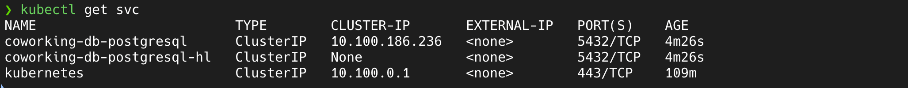

# Coworking Space Service Extension
The Coworking Space Service is a set of APIs that enables users to request one-time tokens and administrators to authorize access to a coworking space. This service follows a microservice pattern and the APIs are split into distinct services that can be deployed and managed independently of one another.

For this project, you are a DevOps engineer who will be collaborating with a team that is building an API for business analysts. The API provides business analysts basic analytics data on user activity in the service. The application they provide you functions as expected locally and you are expected to help build a pipeline to deploy it in Kubernetes.

## Dependencies

### Local Environment

1. Python Environment - run Python 3.6+ applications and install Python dependencies via `pip`
2. Docker CLI - build and run Docker images locally
3. `kubectl` - run commands against a Kubernetes cluster
4. `helm` - apply Helm Charts to a Kubernetes cluster

### Remote Resources

1. AWS CodeBuild - gaurs-cd12355-codebuild to build Docker images remotely and push them to ECR.
2. AWS ECR - gaurs-cd12355-ecr to store Docker images
3. Kubernetes Environment with AWS EKS -
   1. gaurs-cd12355-cluster EKS cluster
   2. gaurs-cd12355-nodegroup EKS nodegroup
4. AWS CloudWatch - monitor activity and logs in EKS
5. GitHub - [Repo](https://github.com/gaurscode/cd12355-microservices-aws-kubernetes-project-starter) to store code and track changes

Once you have the dependencies set up, you can proceed with the setup by following the instructions below:

```bash
# update local kubeconfig
aws eks update-kubeconfig --name gaurs-cd12355-cluster --region us-east-1 --kubeconfig ~/.kube/config

# verify the connection
kubectl get pods -A
```

## Setup

### Configure a Database

Set up a Postgres database using a Helm Chart.

1. Set up Bitnami Repo: `helm repo add bitnami https://charts.bitnami.com/bitnami`
2. Update the newly added repo: `helm repo update`
3. Create pv for the database: `kubectl apply -f db/pv.yaml`
4. Create pvc for the database: `kubectl apply -f db/pvc.yaml`
5. Install PostgreSQL Helm Chart:

```sh
helm install coworking-db bitnami/postgresql \
 --set primary.persistence.existingClaim=coworking-pvc \
 --set primary.persistence.enabled=true \
 --set primary.persistence.storageClass=gp2 \
 --set volumePermissions.enabled=true
```



By default, it will create a username `postgres`. The password can be retrieved with the following command:

```bash
export POSTGRES_PASSWORD=$(kubectl get secret --namespace default coworking-db-postgresql -o jsonpath="{.data.postgres-password}" | base64 -d)

echo $POSTGRES_PASSWORD
```

### Load Data

The next step is to create a database and a user for the application.

```bash
kubectl -n default cp ./1_create_tables.sql coworking-db-postgresql-0:/tmp
kubectl -n default cp ./2_seed_users.sql coworking-db-postgresql-0:/tmp
kubectl -n default cp ./3_seed_tokens.sql coworking-db-postgresql-0:/tmp
```

and then run the scripts to load the data:

```bash
# execute the scripts
kubectl -n default exec -it coworking-db-postgresql-0 -- PGPASSWORD="$POSTGRES_PASSWORD" psql -U postgres -d postgres -f /tmp/1_create_tables.sql
kubectl -n default exec -it coworking-db-postgresql-0 -- PGPASSWORD="$POSTGRES_PASSWORD" psql -U postgres -d postgres -f /tmp/2_seed_users.sql
kubectl -n default exec -it coworking-db-postgresql-0 -- PGPASSWORD="$POSTGRES_PASSWORD" psql -U postgres -d postgres -f /tmp/3_seed_tokens.sql
```

## Build Pipeline

The build pipeline is set up using AWS CodeBuild. The pipeline is triggered when a new commit is pushed to the `main` branch. The pipeline builds the Docker image, tags it, and pushes it to ECR.

Here is a build spec for the pipeline:

```yaml
version: 0.2

phases:
  pre_build:
    commands:
      - echo Logging into ECR
      - aws ecr get-login-password --region $AWS_DEFAULT_REGION | docker login --username AWS --password-stdin $AWS_ACCOUNT_ID.dkr.ecr.$AWS_DEFAULT_REGION.amazonaws.com
  build:
    commands:
      - echo Starting build at `date`
      - echo Building the Docker image          
      - docker build -t $IMAGE_REPO_NAME:$CODEBUILD_BUILD_NUMBER .
      - docker tag $IMAGE_REPO_NAME:$CODEBUILD_BUILD_NUMBER $AWS_ACCOUNT_ID.dkr.ecr.$AWS_DEFAULT_REGION.amazonaws.com/$IMAGE_REPO_NAME:$CODEBUILD_BUILD_NUMBER      
  post_build:
    commands:
      - echo Completed build at `date`
      - echo Pushing the Docker image...
      - docker push $AWS_ACCOUNT_ID.dkr.ecr.$AWS_DEFAULT_REGION.amazonaws.com/$IMAGE_REPO_NAME:$CODEBUILD_BUILD_NUMBER
```

This build spec is used to build the Docker image and push it to ECR using the following Dockerfile:

```bash
# Use 
FROM python:alpine3.19

# Set the working directory inside the container
WORKDIR /app

# Copy the current directory contents to the container at /app
COPY /analytics/ /app

# Install dependencies from requirements.txt
RUN pip install --no-cache-dir -r /app/requirements.txt

# Expose port 5000
EXPOSE 5000

# Set environment variable(s)
ENV DB_USERNAME=postgres
ENV DB_PASSWORD=********
ENV DB_HOST=coworking-db-postgresql
ENV DB_PORT=5432
ENV DB_NAME=postgres

# Run the application when the container starts
CMD python /app/app.py
````
